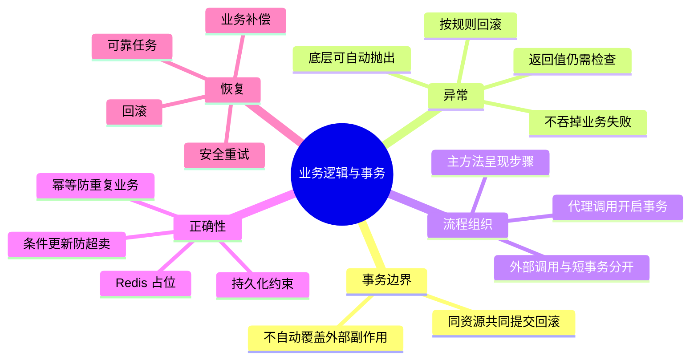

# 第三章导图与大纲

正文：[[00-第三章-业务逻辑与事务]]。

```mermaid
mindmap
  root((业务逻辑与事务))
    事务边界
      同资源共同提交回滚
      不自动覆盖外部副作用
    异常
      按规则回滚
      不吞掉业务失败
      底层可自动抛出
      返回值仍需检查
    流程组织
      主方法呈现步骤
      代理调用开启事务
      外部调用与短事务分开
    正确性
      条件更新防超卖
      幂等防重复业务
      Redis 占位
      持久化约束
    恢复
      回滚
      安全重试
      业务补偿
      可靠任务
```

XMind 导入文件：[[第三章-业务逻辑与事务-XMind导入大纲]]。提供 Markdown 大纲，未生成原生 .xmind，未验证应用内渲染或本地导入。
