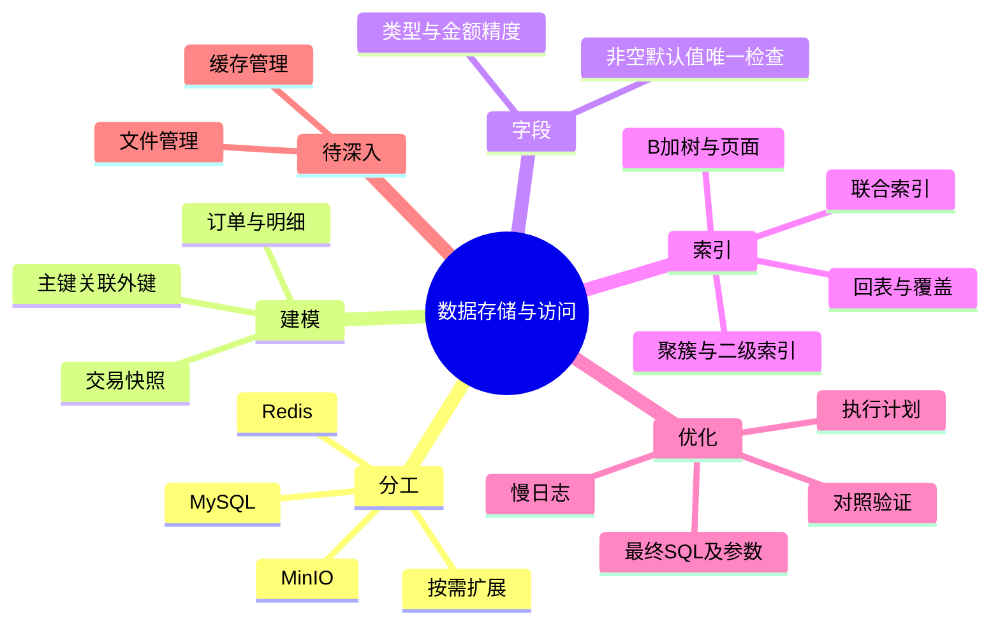

# 第四章导图与大纲（学习中）

正文：[[00-第四章-数据存储与访问]]。

```mermaid
mindmap
  root((数据存储与访问))
    分工
      MySQL
      Redis
      MinIO
      按需扩展
    建模
      主键关联外键
      订单与明细
      交易快照
    字段
      类型与金额精度
      非空默认值唯一检查
    索引
      B加树与页面
      聚簇与二级索引
      回表与覆盖
      联合索引
    优化
      慢日志
      最终SQL及参数
      执行计划
      对照验证
    待深入
      缓存管理
      文件管理
```

XMind Markdown 文件：[[第四章-数据存储与访问-XMind导入大纲]]。非原生 .xmind，未验证应用内渲染或本地导入。
